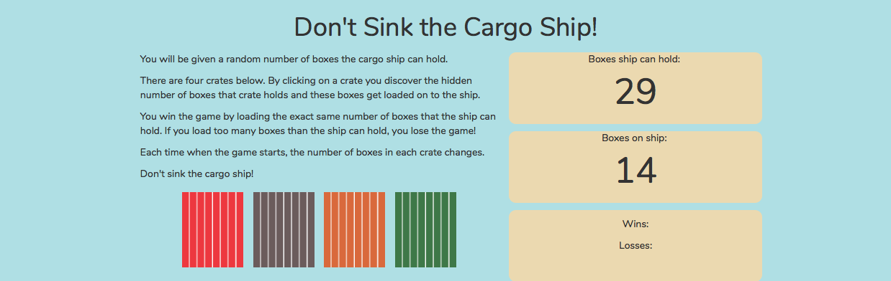

# Don't Sink the Cargo Ship!

## Overview

A random number game that utilizes HTML5, CSS and jQuery. 

## How it Works
- There will be four crates as buttons on the page. When you click a crate, you discover the hidden number of boxes that crate holds and these boxes get loaded on to the ship.
- The player will be shown a random number at the start of the game, which in this case are the number of boxes the ship can hold. 
- You win the game by loading the exact same number of boxes that the ship can hold. If you load too many boxes than the ship can hold, you lose the game!
- Each time when the game starts, the number of boxes in each crate changes. 
- Don't sink the cargo ship!

## Experience the App

* View the app: [GitHub Pages Link](https://nicolelcarvalho.github.io/Dont-Sink-the-Cargo-Ship/)

## Illustration

## Tech Used
- HTML
- CSS
- jQuery

## Built With

* Sublime Text - Text Editor